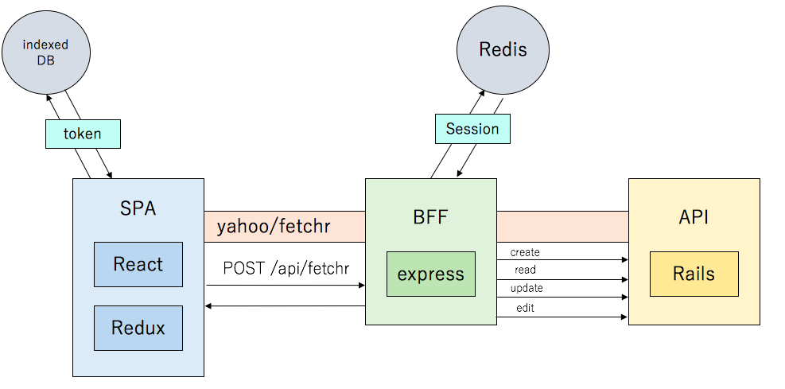

# slide-synchronizer-as-a-service

Architecture
---

Tasks
---

Configured tasks by [saku](https://github.com/kt3k/saku).

- **init** : `saku init`
  > initialize for development
- **dev** : `saku dev`
  > start develop server
- **lint** : `saku lint`
  > lint source code

Show detail: **[:m: saku.md](./saku.md)**
